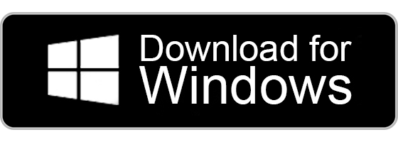

# SmartBMS Utility

## Summary
Welcome to SmartBMS Utility, an advanced app for optimizing energy management and extending battery life. Monitor and control your Battery Management System (BMS) from your smartphone with real-time data on charge, consumption, and more. Make informed decisions to minimize wastage and increase efficiency. Customize settings for personalized charging and discharging plans. Your data is securely stored locally. Currently compatible with JBD BMS. Easy setup for eco-conscious homeowners, solar enthusiasts, and campers. Unleash your BMS's potential for sustainable energy. Download now for smarter energy use! Contact us for inquiries. Thank you for your interest and support!

Support for Daly BMS since version 3.1

## Download App

| Android | iOS & MacOS | Windows |
|:-:|:-:|:-:|
|  |  |  

[Changelog](/changelog.md)

## Platform-Features

| Platform | Bluetooth Connectivity | WebSerial Support | Native Serial Communication |
|----------|------------------------|-------------------|-----------------------------|
| iOS      | ✔ Working              | -                 | ❌ Unsupported              |
| macOS    | ✔ Working              | -                 | ✔ Working                   |
| Android  | ✔ Working              | -                 | ❌ Unsupported              |
| Windows  | ✔ Working              | -                 | ✔ Working                   |
| Web      |❌ Unsupported          | ✔ Working         | ❌ Unsupported              |

### Become a Beta Tester?

If you want to have access to features before anyone else, you can contact us and register as beta tester. You will be able to help us release a stable and flawless release version.

[iOS Tester](https://testflight.apple.com/join/YWdbkZ8s)

[Android Tester](https://SmartBMsUtility.com/contact)

### You can buy a JBD BMS here

[lithiumbatterypcb.com](https://www.lithiumbatterypcb.com/)

[overkillsolar.com](https://overkillsolar.com/)

or buy prebuild batteries here:

[Liontron](https://liontron.com)
